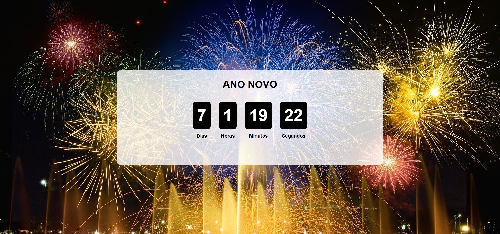

# Contagem Regressiva

- É um aplicativo web de contagem regressiva que permite aos usuários definirem uma data específica para a qual desejam contar o tempo restante. O aplicativo exibe a contagem regressiva em dias, horas, minutos e segundos, e pode ser personalizado com diferentes temas e estilos.

## Demonstração


* [Ver o projeto online](https://countdown-six-beta.vercel.app/)

## Estrutura do projeto

```
REACT/
└── countdown/
    ├── public/
    │   └── vite.svg
    ├── src/
    │   ├── assets/
    │   │   └── ano_novo.jpg
    │   ├── components/
    │   │   ├── Counter.css
    │   │   ├── Counter.jsx
    │   │   ├── Title.css
    │   │   └── Title.jsx
    │   ├── context/
    │   │   └── CountdownContext.jsx
    │   ├── hooks/
    │   │   └── useCountdown.jsx
    │   ├── routes/
    │   │   ├── Countdown.jsx
    │   │   ├── Home.css
    │   │   └── Home.jsx
    │   ├── App.css
    │   ├── App.jsx
    │   ├── index.css
    │   └── main.jsx
    ├── .gitignore
    ├── eslint.config.js
    ├── index.html
    ├── package-lock.json
    ├── package.json
    ├── README.md
    ├── vercel.json
    └── vite.config.js
```

## Tecnologias utilizadas

- HTML
- CSS
- JavaScript
- React
- Vite
- Vercel

## Funcionalidades

Quando o usuário acessar o aplicativo, ele deve:

1. Definir um título para a contagem regressiva.
2. Definir uma data
3. Definir uma imagem de fundo (opcional)
4. A cor do tema (opcional)

O aplicativo deve exibir a contagem regressiva em tempo real, atualizando a cada segundo.

## Aprendizados

- contexto da contagem regressiva.
- Background dinâmico.
- hook useCountdown para calcular o tempo restante.
- Formulário controlado para definir a contagem regressiva.
- responsividade para diferentes tamanhos de tela.
- UX Automatizado: criei uma lógica para calcular automaticamente o contraste para acessibilidade, a função getBrightness() converte a cor hex escolhida pelo usuário em valor de luminância. No App.jsx, uso isso para definir overlay dinâmico no container: se a cor clara > 128, fundo preto semi-transparente; se escura, branco. Garante legibilidade perfeita do conteúdo sobre qualquer tema/background customizado, sem texto invisível.

## Problemas e Bugs

- O aplicativo não salva a contagem regressiva definida pelo usuário, então se o usuário atualizar a página, ele perderá as configurações.
- O aplicativo não tem uma opção para pausar ou reiniciar a contagem regressiva.
- O aplicativo não tem uma opção para compartilhar a contagem regressiva com outras pessoas.
- O aplicativo não tem uma opção para definir um som de alarme quando a contagem regressiva chegar a zero.
- Se tiver encontrado algum bug ou problema, sinta-se à vontade para abrir uma issue com os detalhes ou corrigir o problema.

## Autor

- Mentor: [Matheus Battisti - Hora de Codar](https://www.youtube.com/@MatheusBattisti)
- Desenvolvedor: Guilherme Amorim