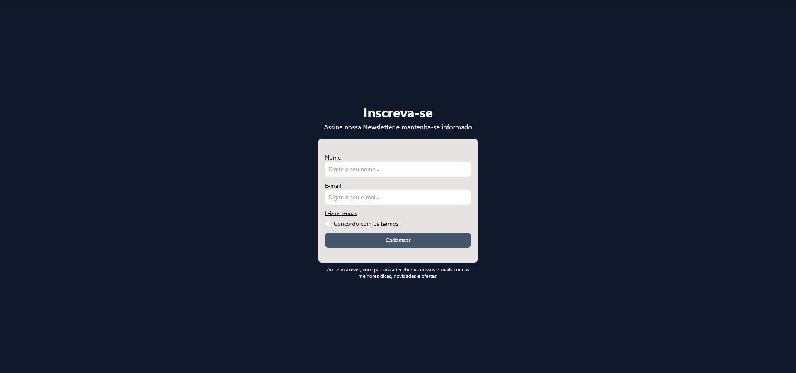

# Formulário de inscrição

- Esse projeto é um exemplo de formulário de inscrição para uma newsletter, criado com HTML e CSS. Ele inclui campos para o nome e email do usuário, além de um botão de envio.

## Demonstração


* [Veja o projeto online aqui](https://form-newsletter-five.vercel.app/)

## Estrutura do projeto

```
REACT/
└── form_newsletter/
    ├── public/
    │   └── vite.svg
    ├── src/
    │   ├── assets/
    │   │   └── react.svg
    │   ├── components/
    │   │   └── Form.tsx
    │   ├── types/
    │   │   └── User.ts
    │   ├── utils/
    │   │   └── validate.ts
    │   ├── App.css
    │   ├── App.tsx
    │   ├── index.css
    │   ├── main.tsx
    │   └── vite-env.d.ts
    ├── .gitignore
    ├── eslint.config.js
    ├── index.html
    ├── package-lock.json
    ├── package.json
    ├── README.md
    ├── tsconfig.app.json
    ├── tsconfig.json
    ├── tsconfig.node.json
    └── vite.config.ts
```

## Tecnologias utilizadas

- HTML
- Tailwind CSS
- TypeScript
- React
- Vite
- Vercel

## Aprendizados

- configurando o projeto com vite, typescript e react.
- Aprendendo a usar o Tailwind CSS para estilizar o formulário de inscrição.
- Formulário de inscrição responsivo e acessível.
- Validação de formulário usando TypeScript e React.
- gerenciamento de erros via state typescript e react.
- interface para dados do form usando TypeScript.
- layout responsivo usando Tailwind CSS.

## Problemas e Bugs

- Se tiver encontrado algum bug ou problema, sinta-se à vontade para abrir uma issue com os detalhes ou corrigir o problema.

## Autor

- Mentor: [Matheus Battisti - Hora de Codar](https://www.youtube.com/@MatheusBattisti)
- Desenvolvedor: Guilherme Amorim