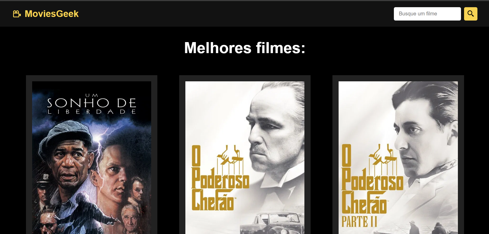

# Movies Geek

- Web App responsivo que centraliza informações detalhadas sobre filmes, permitindo buscas rápidas e descobertas de novos títulos em tempo real.
- Para quem é apaixonado por cinema, o Movies Geek é a plataforma ideal para explorar um vasto catálogo de filmes e ler sinopses.

## Demonstração


* [Ver o projeto online](https://movies-geek.vercel.app/)

## Estrutura do Projeto

```
REACT/
└── movies_geek/
    ├── public/
    │   ├── favicon.ico
    │   └── vite.svg
    ├── src/
    │   ├── components/
    │   │   ├── MovieCard.jsx
    │   │   ├── Navbar.css
    │   │   └── Navbar.jsx
    │   ├── pages/
    │   │   ├── Footer.css
    │   │   ├── Footer.jsx
    │   │   ├── Home.jsx
    │   │   ├── Movie.css
    │   │   ├── Movie.jsx
    │   │   ├── MoviesGrid.css
    │   │   └── Search.jsx
    │   ├── App.css
    │   ├── App.jsx
    │   ├── index.css
    │   └── main.jsx
    ├── .env
    ├── .gitignore
    ├── eslint.config.js
    ├── index.html
    ├── package-lock.json
    ├── package.json
    ├── README.md
    ├── vercel.json
    └── vite.config.js
```

## Tecnologias Utilizadas

- HTML
- CSS
- JavaScript
- React
- Vite
- API de Filmes (TMDb)

## Funcionalidades

- busca de filmes por titulo.
- visualização de detalhes do filme.

## Aprendizados

- Integração com API de Filmes (TMDb).
- Gerenciamento de estado com React.
- Design responsivo para diferentes dispositivos.
- Implementação de rotas com React Router.
- Otimização de desempenho e experiência do usuário.
- Deploy e hospedagem na Vercel.
- Gerenciamnento de variáveis de ambiente para segurança da chave da API.
- vite para construção e desenvolvimento rápido.

## API

- [The Movie Database (TMDb) API](https://www.themoviedb.org/documentation/api)

Este projeto consome a The Movie Database (TMDB) API para obter informações atualizadas sobre filmes, posters e avaliações.

### Como obter uma chave?

1. Crie uma conta no The Movie Database.
2. Vá até as configurações de API no seu perfil.
3. Gere uma nova chave (API Key).

### EndPoints Principais

- GET /search/movie: Busca filmes por título.
- GET Images: https://image.tmdb.org/t/p/w500/ - URL base para renderização dos posters.

## Problemas e Bugs

- Se tiver encontrado algum bug ou problema, sinta-se à vontade para abrir uma issue com os detalhes ou corrigir o problema.

## Autor

- Mentor: [Matheus Battisti - Hora de Codar](https://www.youtube.com/@MatheusBattisti)
- Desenvolvedor: Guilherme Amorim