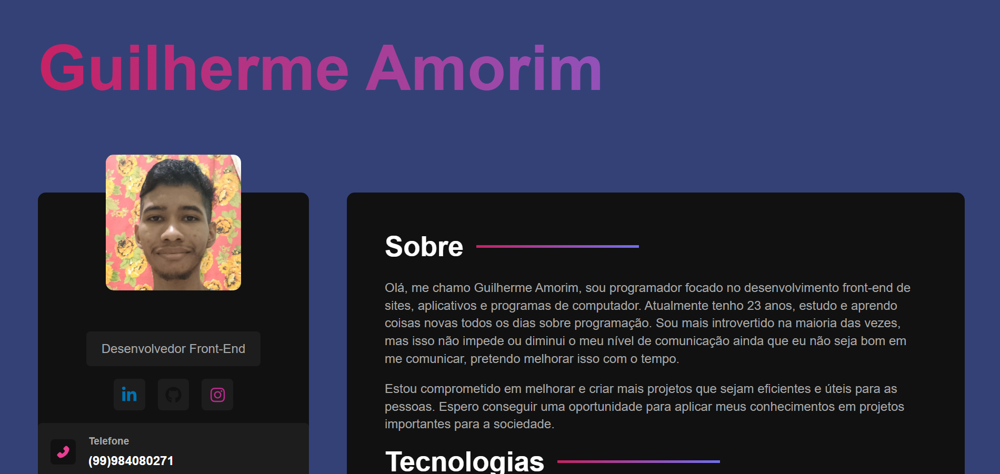

# Portfólio

- Este projeto é um exemplo de portfólio de trabalho.

## Demonstração


* [Veja o projeto online](https://portfolio-sass-ten.vercel.app/)

## Estrutura do Projeto

```
REACT/
└── portfolio_sass/
    ├── public/
    │   └── vite.svg
    ├── src/
    │   ├── components/
    │   │   ├── AboutContainer.jsx
    │   │   ├── InformationContainer.jsx
    │   │   ├── MainContent.jsx
    │   │   ├── ProjectsContainer.jsx
    │   │   ├── Sidebar.jsx
    │   │   ├── SocialNetworks.jsx
    │   │   └── TechnologiesContainer.jsx
    │   ├── img/
    │   │   └── eu.png
    │   ├── styles/
    │   │   ├── components/
    │   │   │   ├── app.sass
    │   │   │   ├── informationcontainer.sass
    │   │   │   ├── maincontent.sass
    │   │   │   ├── sidebar.sass
    │   │   │   ├── socialnetworks.sass
    │   │   │   └── technologiescontainer.sass
    │   │   ├── main.sass
    │   │   ├── mixins.sass
    │   │   └── variables.sass
    │   ├── App.jsx
    │   └── main.jsx
    ├── .gitignore
    ├── eslint.config.js
    ├── index.html
    ├── package-lock.json
    ├── package.json
    ├── README.md
    └── vite.config.js
```

## Tecnologias Utilizadas

- HTML
- SASS
- JavaScript
- React
- Vite
- Vercel (para hospedagem)

## Aprendizados

- reutilização de componentes em React
- Arquitetura modular com SASS.
- boas práticas e responsividade com SASS.
- react icons

## Problemas e Bugs

- Se tiver encontrado algum bug ou problema, sinta-se à vontade para abrir uma issue com os detalhes ou corrigir o problema.

## Autor

- Mentor: [Matheus Battisti - Hora de Codar](https://www.youtube.com/@MatheusBattisti)
- Desenvolvedor: Guilherme Amorim