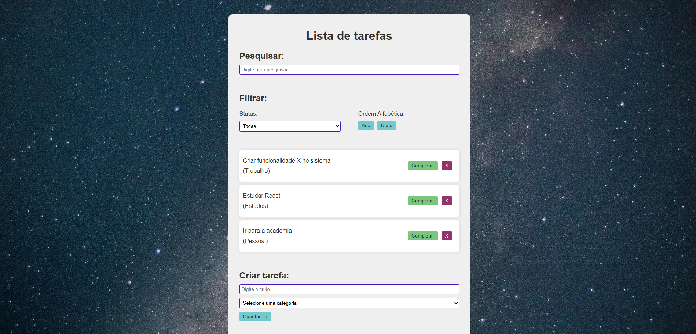

# Lista de Tarefas

- Esse projeto é uma simples aplicação de lista de tarefas, onde os usuários podem adicionar, buscar, editar e remover tarefas.

## Demonstração


* [Veja o projeto online aqui](https://todo-black-nine.vercel.app/)

## Estrutura do projeto

```
REACT/
└── todo/
    ├── public/
    │   └── vite.svg
    ├── src/
    │   ├── components/
    │   │   ├── Filter.jsx
    │   │   ├── Search.jsx
    │   │   ├── Todo.jsx
    │   │   └── TodoForm.jsx
    │   ├── img/
    │   │   └── universo.jpg
    │   ├── App.css
    │   ├── App.jsx
    │   └── main.jsx
    ├── .gitignore
    ├── eslint.config.js
    ├── index.html
    ├── package-lock.json
    ├── package.json
    ├── README.md
    └── vite.config.js
```

## Tecnologias utilizadas

- HTML
- CSS
- JavaScript
- React
- Vite
- Vercel (para hospedagem)

## Funcionalidades

- Adicionar tarefas, definindo um título e escolhendo uma categoria.
- Buscar tarefas por título.
- Filtrar tarefas por status e ordem alfabética (ascendente ou descendente).
- editar tarefas existentes, as marcando como concluídas ou desmarcando-as.
- remover tarefas da lista.

## Aprendizados

- sistema crud (create, read, update, delete) para gerenciar as tarefas.
- uso de estados e props para gerenciar a aplicação.
- manipulação de arrays para adicionar, buscar, editar e remover tarefas.
- implementação de filtros para organizar as tarefas.
- form controlado para adicionar novas tarefas.
- componentes reutilizáveis para melhorar a estrutura do código.
- UX/UI para criar uma interface amigável e intuitiva para os usuários.

## Problemas e Bugs

- Se tiver encontrado algum bug ou problema, sinta-se à vontade para abrir uma issue com os detalhes ou corrigir o problema.

## Autor

- Mentor: [Matheus Battisti - Hora de Codar](https://www.youtube.com/@MatheusBattisti)
- Desenvolvedor: Guilherme Amorim.